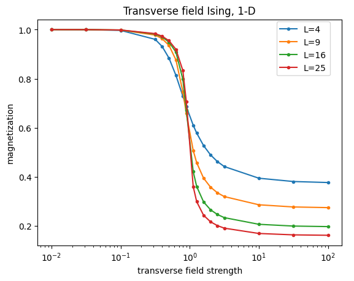
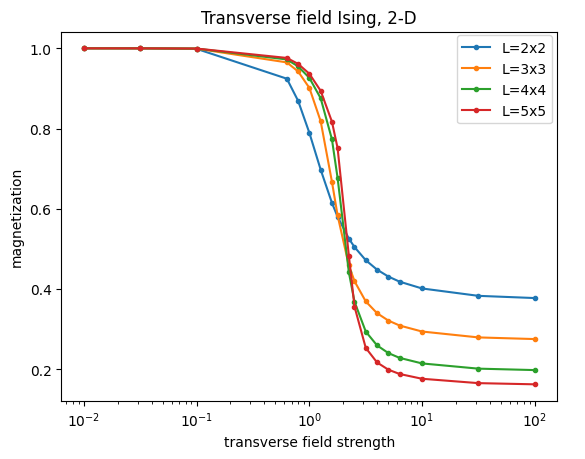
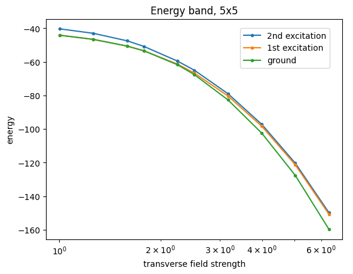
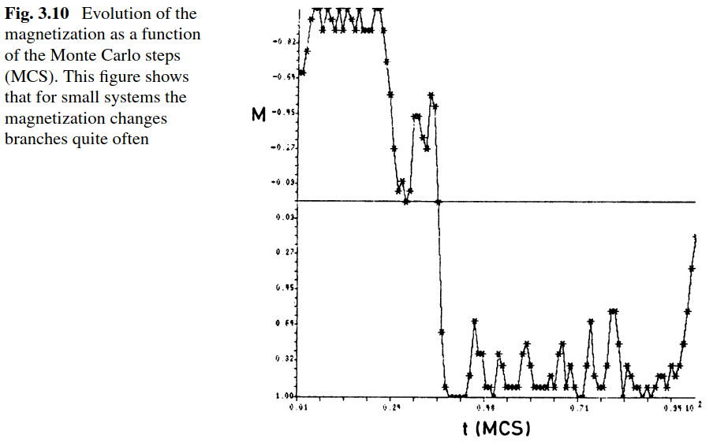
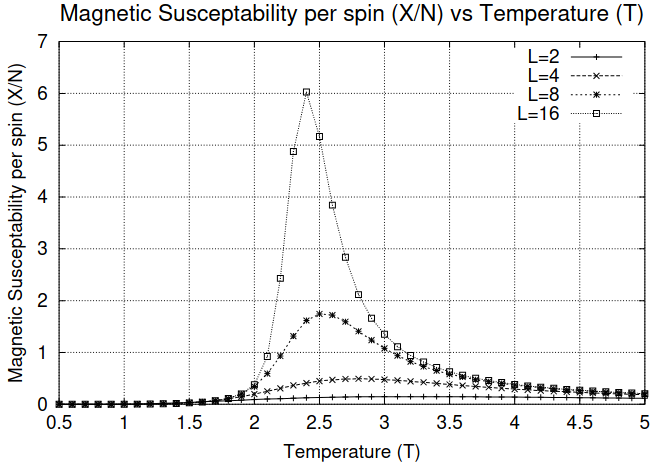
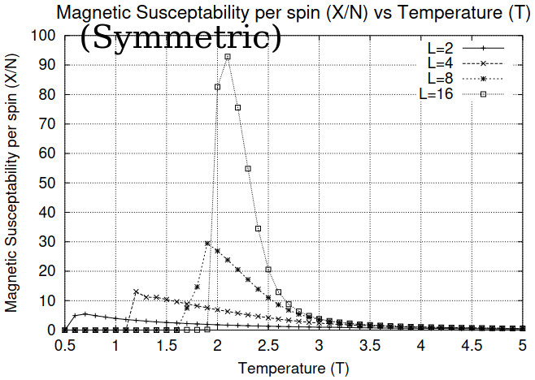

# Quantum Ising Model

The transverse field Ising model is defined with the hamiltonian[^1]:

```math
H=-\sum_{i, j}^{}\sigma^{z}_{i}\otimes\sigma_{j}^{z}-h\sum_{i}^{}\sigma_{i}^{x}
```

where $\sigma^{z}$ and $\sigma^{x}$ are the Pauli Z and X matrics respectively, and $h$ is the transverse magnetic field strength.
This model is realized in physical experiments related to quantum computing[^2][^3].
The state that is observed in these physical experiments is the ground state of $H$, defined as the eigenvector of $H$'s smallest eigenvalue $|\psi_{ground}\rangle = \sum_{b}^{2^{N}}c_{b}|\psi_{b}\rangle$, where $|\psi_{b}\rangle$ are basis states $|\uparrow \uparrow \uparrow \cdots \rangle$, $|\downarrow \downarrow \downarrow \cdots \rangle$, $|\uparrow \uparrow \downarrow \cdots \rangle$ and so on.
Note that for a composite system of $N$ spins, there are in total $2^{N}$ basis states.

Magnetization is defined as the average Z spin

```math
\left\langle M \right\rangle=\sum_{b}^{2^{N}}p_{b}\frac{\sum_{i}^{N}\sigma_{bi}^{z}}{N}
```

where $p_{b}=\overline{c_{b}}c_{b}$ is the probability at basis state $|\psi_{b}\rangle$.

With magnetization as the order parameter, we get the following graph showing the existence of a phase transition at critical field strength $h_{c}=1$ in the one dimensional case:



This differs from the classical situation where the 1-D Ising model lacks a phase transition.
In the quantum model, the fluctuations required by the phase transition is provided by the transverse field $\sigma^{x}$ which contains off-diagonal matrix elements.
In the two dimensional case, we get $h_{c}\simeq 2.5$ which is close to the theoretical infinite lattice size case of $h_{c}=3$ (Table 3.1 Suzuki[^4], Fig. 4 Hesselmann[^5]).



This phase transition can also be seen in the band diagram of the ground and excitation states.
We see that as the transverse field approaches $h_{c}$, the ground and 1st excitation energies diverge from being in a shared degenerate state, to two separate states.



## Non-symmetric probability distribution in simulation

The basis state probability $p_{b}$ used in our simulations is a non-symmetric one, as opposed to the one belonging to the original hamiltonian $p_{b}^{H}$.
$p_{b}$ is defined as

```math
\displaylines{
p_{b} = \left\{\begin{aligned}
        p_{b}^{H} + p_{b'}^{H}, && b_{\#up} > b_{\#down}\\
        p_{b}^{H}, && b_{\#up} = b_{\#down}\\
        0, && b_{\#up} < b_{\#down}\\
        \end{aligned}\right.
}
```

where $p_{b'}^{H}$ is the probability of the basis state with all the spins in $|\psi_{b}\rangle$ flipped, $b_{\\# up}$ and $b_{\\#down}$ are the number of spin ups and downs in basis state $|\psi_{b}\rangle$.

In real world experiments, such a non-symmetric distribution is a more realistic description, as it is unlikely to see all $N$ spins flipped down if the initial state is prepared with all up spins, especially when $N$ is very large.
However, due to the finite lattice size of simulations, the characteristic time where the system flips from +M to -M state is much smaller than the observation time as seen in the below graph from Fig 3.10, Section 3.4, Binder et al.[^6]:



Such a non-symmetric distribution in effect measures the average absolute value of magnetization $\left\langle \left| M \right| \right\rangle$ as opposed to the raw average magenetization $\left\langle M \right\rangle$, which in the case of $h\sim 0$ is always 0 for a symmetric hamiltonian like ours.
In the classical 2-D Ising model where $T_{c}=2.269$, we see from the below graphsthat the non-symmetric distribution gives better results (upper graph non-symmetric, lower graph symmetric, from Fig. 14, Fig 15, J. Kotze[^7]):




## References
[^1]: Quantum Ising Phase Transition, Carsten Bauer, Katharine Hyatt, [link](https://juliaphysics.github.io/PhysicsTutorials.jl/tutorials/general/quantum_ising/quantum_ising.html)
[^2]: Quantum Phases of Matter on a 256-Atom Programmable Quantum Simulator, Sepehr Ebadi et al., [arXiv:2012.12281](https://arxiv.org/pdf/2012.12281)
[^3]: Observation of a Many-Body Dynamical Phase Transition with a 53-Qubit Quantum Simulator, J. Zhang, [arXiv:1708.01044](https://arxiv.org/pdf/1708.01044)
[^4]: Quantum Ising Phases and Transitions in Transverse Ising Models, 2nd Edition, Sei Suzuki, Jun-ichi Inoue, Bikas K. Chakrabarti
[^5]: Thermal Ising transitions in the vicinity of two-dimensional quantum critical point, S. Hesselmann, S. Wesse, [arXiv:1602.02096](https://arxiv.org/pdf/1602.02096)
[^6]: Monte Carlo Simulation in Statistical Physics 6th Ed., Binder, K. & Heermann, D. W.
[^7]: Introduction to Monte Carlo methods for an Ising Model of a Ferromagnet, Jacques Kotze. [arXiv:0803.0217](https://arxiv.org/pdf/0803.0217)
